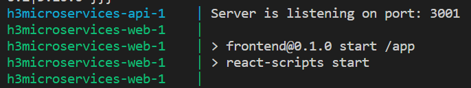
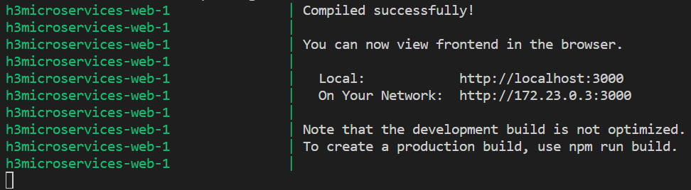

# H3 Microservices

A docker compose project with frontend, backend and db.


In order to run this in docker, simply type ```docker-compose up``` at the command prompt. Docker will then create the [MongoDB](https://www.mongodb.com/) from the stock [mongo](https://hub.docker.com/_/mongo) image. The api uses [nodejs](https://nodejs.org/) with [express](http://expressjs.com/) and is built from a [node:alpine](https://hub.docker.com/_/node) image. The front end uses [ReactJS](https://reactjs.org/) and built from a [node:alpine](https://hub.docker.com/_/node) image.

## Build success

